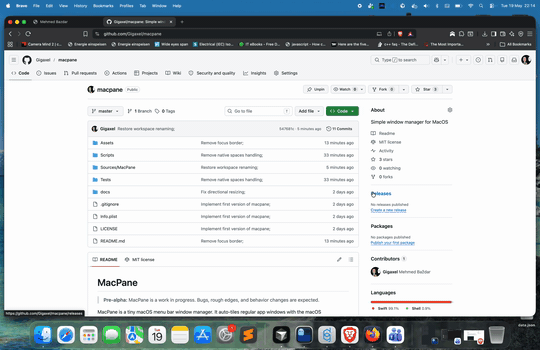

# MacPane

> **Early release:** MacPane is reasonably stable for daily use. Rough edges and behavior changes are still possible. There are no official releases yet; build the app yourself using the instructions below.

MacPane is a tiny macOS menu bar window manager. It auto-tiles regular app windows with the macOS Accessibility API, then lets you focus, swap, resize, and rotate tiles with global keyboard shortcuts.

When MacPane launches, it immediately arranges the windows on each display. It watches for launched apps, closed apps, screen changes, and Accessibility window-created notifications so new windows snap into the layout as they appear.

## Demo



## Shortcuts

- `Cmd+Option+Arrow`: focus the nearest tiled neighbor in that direction.
- `Cmd+Shift+Arrow`: swap the focused window with the nearest tiled neighbor in that direction.
- `Cmd+Ctrl+Arrow`: resize the split containing the focused window.
- `Cmd+Option+O`: rotate the focused fork between horizontal and vertical splits.
- `Cmd+Option+A`: toggle workspace switch animations on or off.
- `Cmd+Option+1...9`: switch MacPane's virtual workspace on the current display.
- `Cmd+Ctrl+1...9`: move the focused tiled window to a MacPane virtual workspace.
- `Cmd+Ctrl+Option+Left/Right` or `Cmd+Ctrl+Option+H/L`: switch to the previous or next MacPane virtual workspace.
- `Cmd+Ctrl+Option+=`: create a new MacPane virtual workspace and switch to it.
- `Cmd+Ctrl+Option+-`: delete the current MacPane virtual workspace when it is empty.
- `Cmd+Ctrl+Option+V`: show a quick visual overview of MacPane virtual workspaces. Press `1...9` while it is visible to switch.

New windows split the currently focused tile, similar to Pop Shell and i3-style binary tiling. Closing a window promotes its sibling so the layout does not leave stale empty space.

## Gaps

Use the menu bar item to increase, decrease, or reset the configurable gap around and between tiled windows. The current gap is stored in `UserDefaults`; the default is `8 px`.

## Build

```bash
./Scripts/test.sh
./Scripts/build-app.sh
```

The app bundle is written to `build/MacPane.app`.

For a stable local install, use:

```bash
./Scripts/install.sh
```

That builds and writes the app to `~/Applications/MacPane.app` by default. You can override the destination with `INSTALL_DIR=/Applications ./Scripts/install.sh`.

## Run

```bash
open build/MacPane.app
```

On first launch, macOS will ask for Accessibility access. If the prompt does not appear, open System Settings, go to Privacy & Security, then Accessibility, and enable MacPane. Quit and reopen MacPane after granting the permission so macOS attaches the permission to the signed app bundle.

## Accessibility Troubleshooting

If macOS keeps asking after you grant access, it is usually because a rebuilt ad-hoc signed app replaced the copy that TCC trusted. Fix it by installing one stable app bundle, then granting permission to that bundle:

```bash
./Scripts/install.sh
open ~/Applications/MacPane.app
```

If there is already a stale MacPane entry in Privacy & Security, remove it from Accessibility and add the newly installed `~/Applications/MacPane.app`. You can also reset only MacPane's Accessibility entry:

```bash
tccutil reset Accessibility com.gigaxel.macpane
```

After resetting, launch the installed app again and grant Accessibility once.

MacPane is a menu bar app, so it does not show a Dock icon or main window.

## License

MacPane is available under the MIT License. See [LICENSE](LICENSE).
